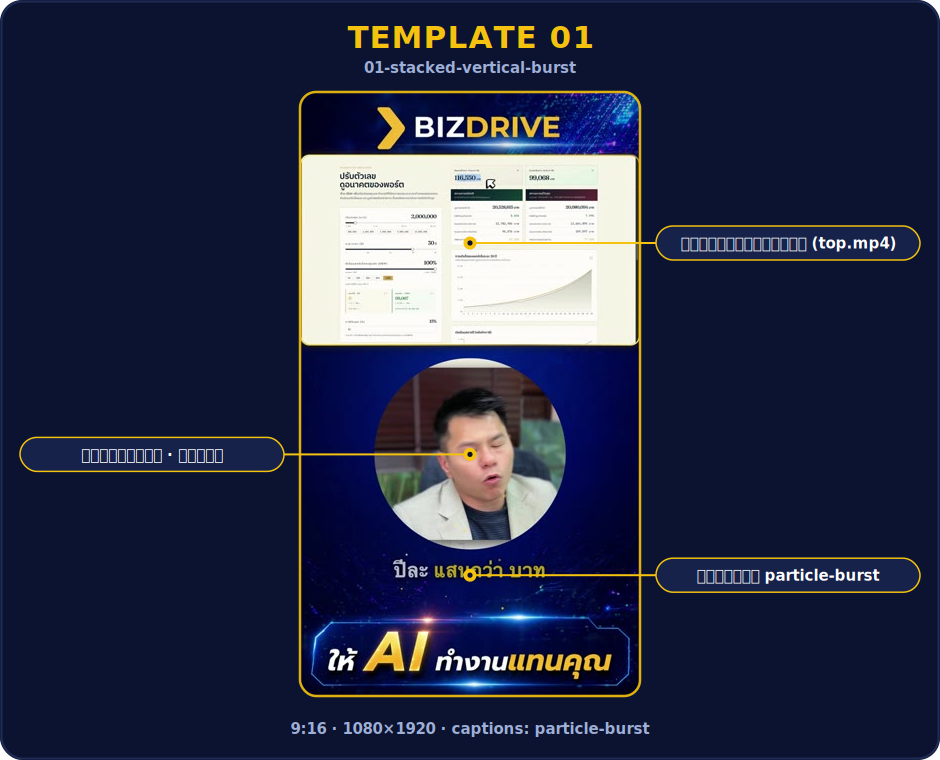
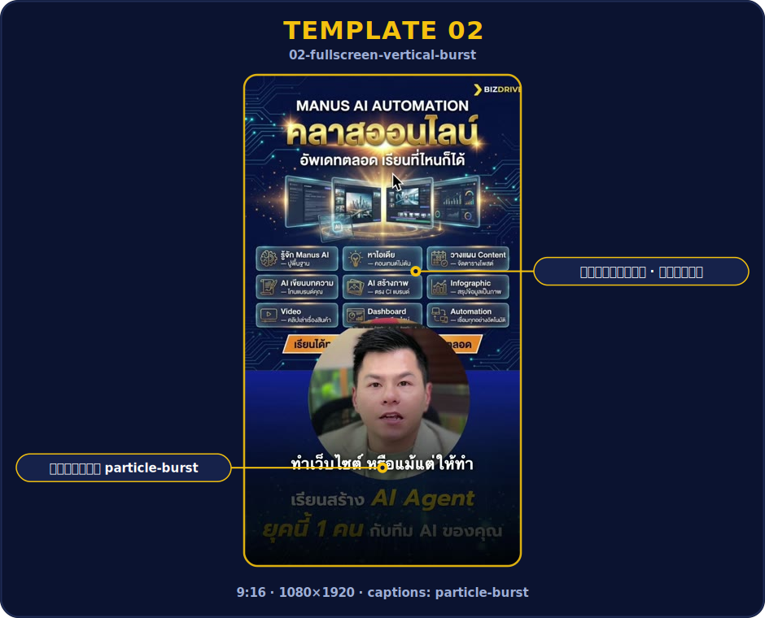
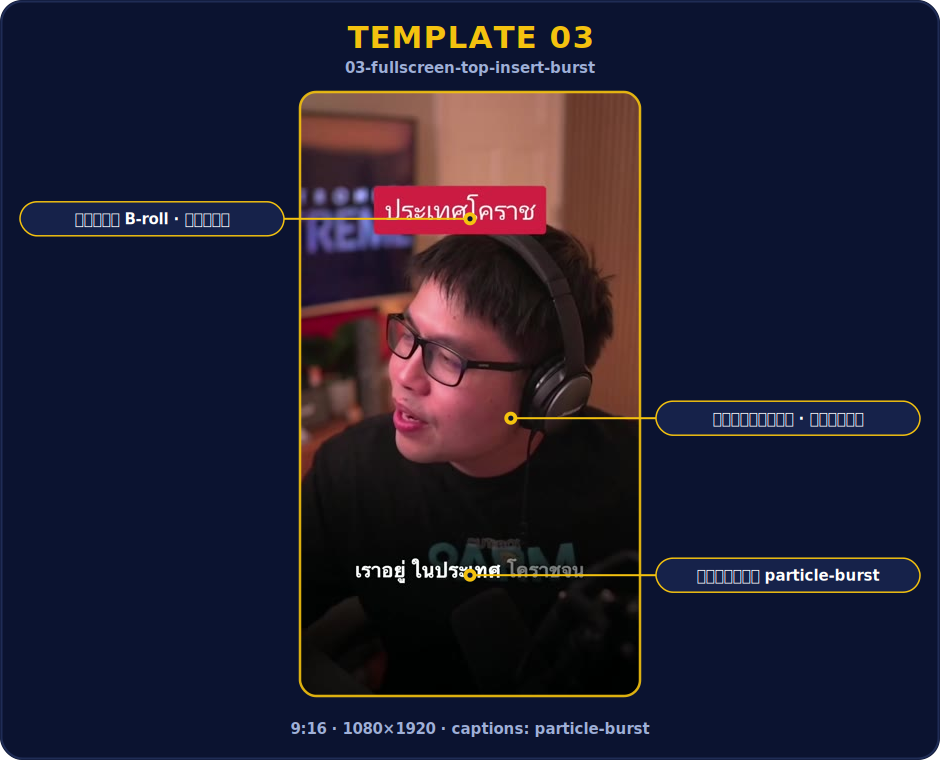
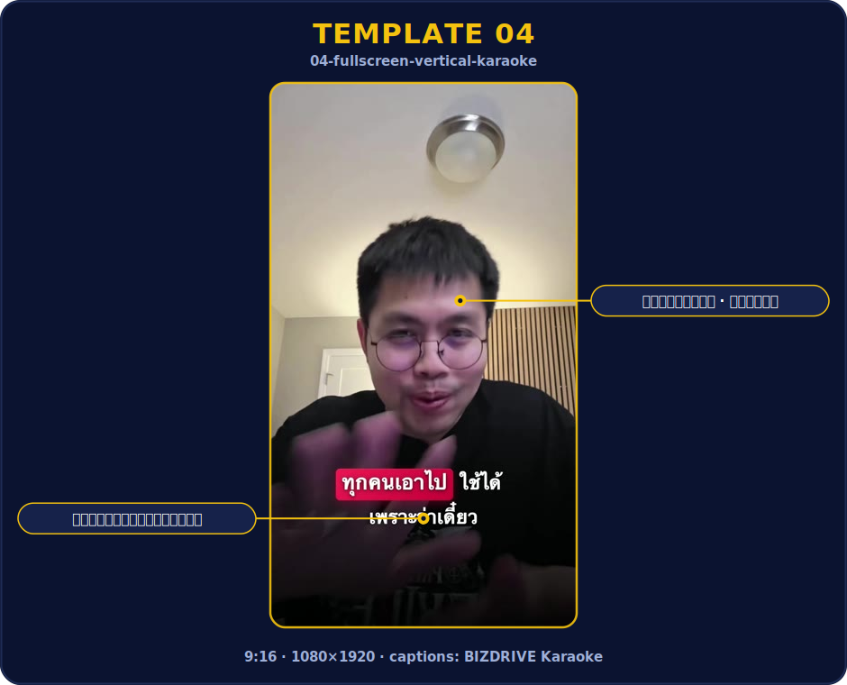
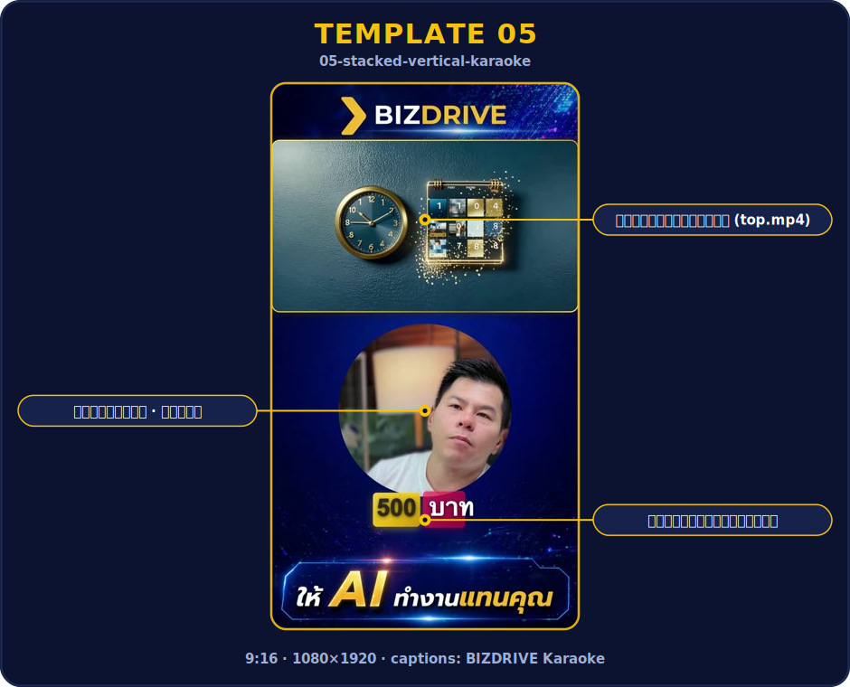
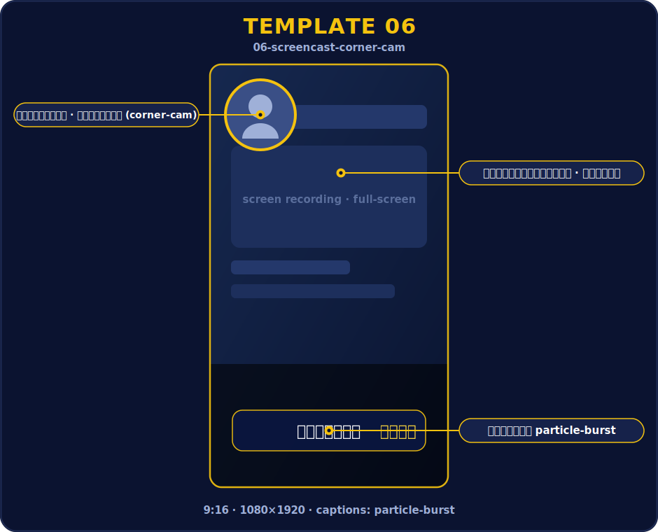
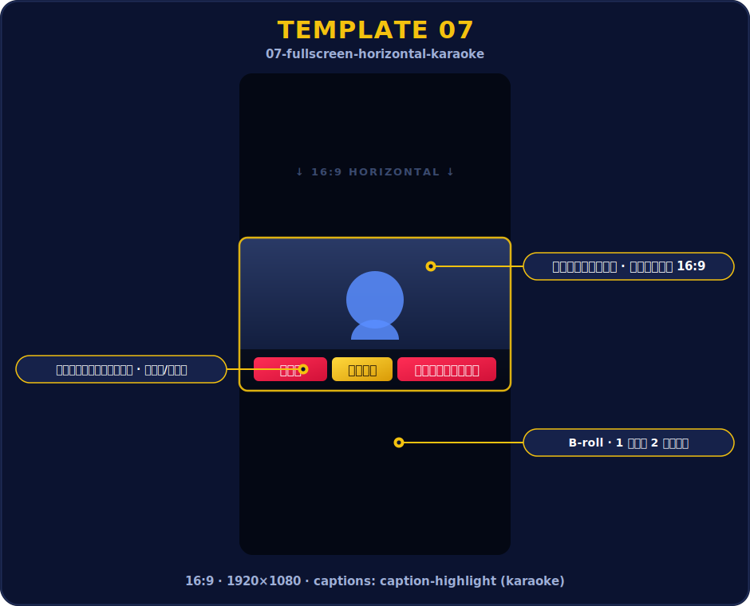
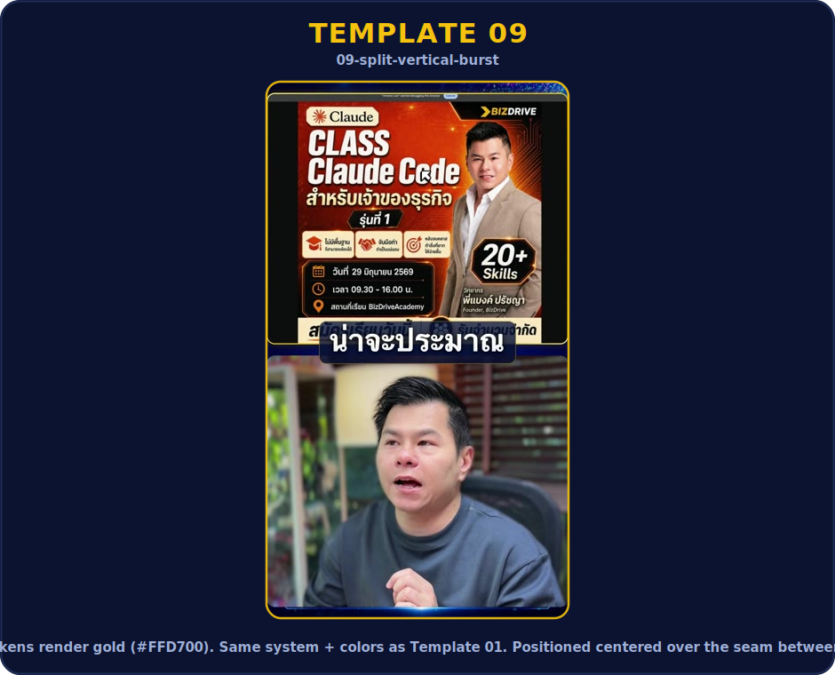
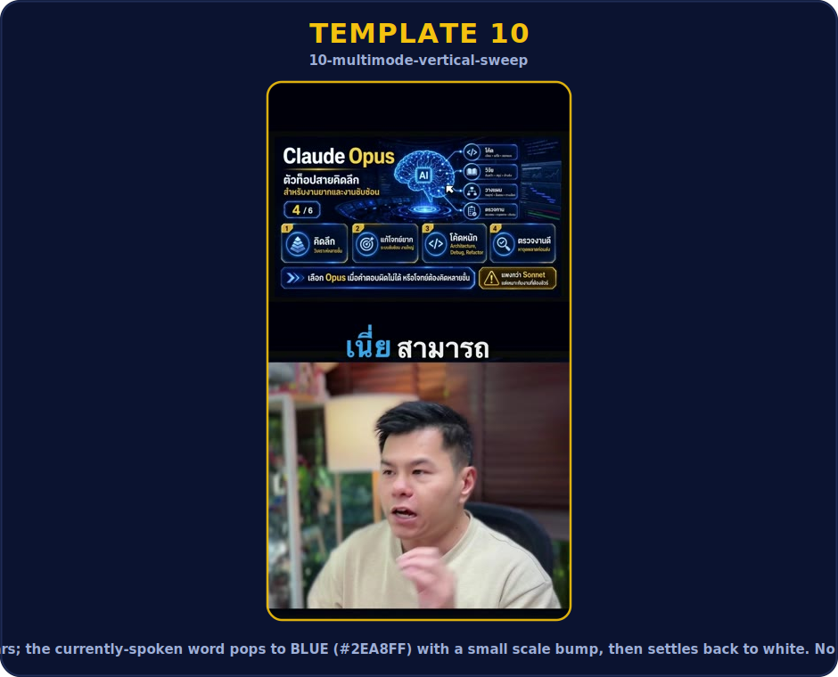
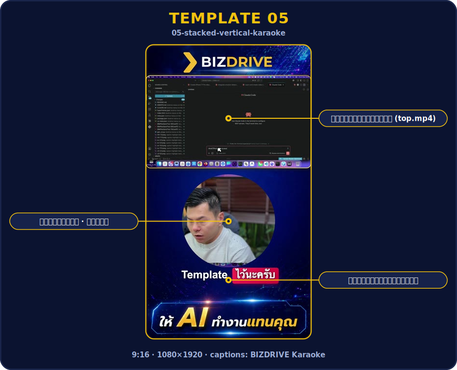

# 🎬 Template Catalog

Visual index of every BIZDRIVE video template. **Auto-generated — do not edit by
hand.** Regenerate after adding or changing a template:

```bash
bash tools/build-catalog.sh
```

Each preview is the template's reference render (or its newest job) with the
layout zones labelled. Start a clip with `bash tools/new-job.sh <NN> <slug> --raw <raw-slug>`.

_Last built: 2026-07-02 22:05_

| Preview | Template |
| :-----: | :------- |
|  | **01 — Stacked Vertical with Particle-Burst Captions**<br>📐 9:16 · 1080×1920 · 30fps<br>💬 Captions: **particle-burst**<br><br>BIZDRIVE-style vertical talking-head video: top frame is screen recording, bottom is face on circle, with kinetic particle-burst captions and optional B-roll inserts.<br><br>📂 `templates/01-stacked-vertical-burst/` · scaffold: `bash tools/new-job.sh 01 <slug> --raw <raw>` |
|  | **02 — Full-screen Vertical with Particle-Burst Captions**<br>📐 9:16 · 1080×1920 · 30fps<br>💬 Captions: **particle-burst**<br><br>Single talking-head video filling the entire 1080x1920 vertical frame, with kinetic particle-burst Thai captions and full-screen B-roll inserts. No top frame, no circle crop — the face video and every B-roll clip cover the whole screen.<br><br>📂 `templates/02-fullscreen-vertical-burst/` · scaffold: `bash tools/new-job.sh 02 <slug> --raw <raw>` |
|  | **03 — Full-screen Vertical with Top Insert + Particle-Burst Captions**<br>📐 9:16 · 1080×1920 · 30fps<br>💬 Captions: **particle-burst**<br><br>Single talking-head video filling the entire 1080x1920 vertical frame, with kinetic particle-burst Thai captions. B-roll plays inside a floating 16:9 rounded insert card over the upper third of the frame — the face video stays visible around the card, it does not cover the whole screen.<br><br>📂 `templates/03-fullscreen-top-insert-burst/` · scaffold: `bash tools/new-job.sh 03 <slug> --raw <raw>` |
|  | **04 — Full-screen Vertical with Karaoke Highlight Captions**<br>📐 9:16 · 1080×1920 · 30fps<br>💬 Captions: **BIZDRIVE Karaoke**<br><br>Single talking-head video filling the entire 1080x1920 vertical frame, with BIZDRIVE Karaoke captions — a coloured box sweeps word-by-word in sync with the speech (red box for normal words, gold box for brand / number / tech tokens). Same full-screen layout and B-roll as Template 02; only the caption system differs.<br><br>📂 `templates/04-fullscreen-vertical-karaoke/` · scaffold: `bash tools/new-job.sh 04 <slug> --raw <raw>` |
|  | **05 — Stacked Vertical with Karaoke Highlight Captions**<br>📐 9:16 · 1080×1920 · 30fps<br>💬 Captions: **BIZDRIVE Karaoke**<br><br>BIZDRIVE-style vertical talking-head video: top frame is screen recording, bottom is face on a circle, with optional B-roll inserts in the top frame. Same stacked layout as Template 01 — the only difference is the caption system: BIZDRIVE Karaoke (caption-highlight), a coloured box that sweeps word-by-word in sync with the speech (red box for normal words, gold box for brand / number / tech tokens).<br><br>📂 `templates/05-stacked-vertical-karaoke/` · scaffold: `bash tools/new-job.sh 05 <slug> --raw <raw>` |
|  | **06 — Screencast with Corner Cam + Particle-Burst Captions**<br>📐 9:16 · 1080×1920 · 30fps<br>💬 Captions: **particle-burst**<br><br>A screen recording fills the entire 1080x1920 vertical frame while the presenter's talking-head face rides along as a small circular corner-cam in the upper-left. The corner-cam stays on screen the whole clip — even while full-screen B-roll plays — so the presenter is always visible. Kinetic particle-burst Thai captions over a lower-third scrim. Built for vertical / phone-screen / app-demo screencasts.<br><br>📂 `templates/06-screencast-corner-cam/` · scaffold: `bash tools/new-job.sh 06 <slug> --raw <raw>` |
|  | **07 — Full-screen Horizontal with Karaoke Highlight Captions (YouTube cut)**<br>📐 16:9 · 1920×1080 · 30fps<br>💬 Captions: **BIZDRIVE Karaoke**<br><br>A 1920x1080 (16:9 horizontal) talking-head edit for YouTube-style long-form cuts. The face video fills the whole frame; B-roll inserts also fill the frame. Captions are BIZDRIVE Karaoke (red/gold word-sweep, the same caption-highlight system as Template 04/05). Long-form B-roll cadence: one 4-second insert per ~2 minutes (not the 9:16 sparse-4/60s rule).<br><br>📂 `templates/07-fullscreen-horizontal-karaoke/` · scaffold: `bash tools/new-job.sh 07 <slug> --raw <raw>` |
|  | **08 — Split Vertical (Rectangle) with Karaoke Highlight Captions**<br>📐 9:16 · 1080×1920 · 30fps<br>💬 Captions: **BIZDRIVE Karaoke word-sweep (coloured box sweeps in left-to-right per spoken word; same system as Template 04/05)**<br><br>BIZDRIVE-style vertical talking-head: clean top/bottom split — top frame is the screen recording, bottom frame is the person as a full-width RECTANGLE (no circle crop) — with BIZDRIVE Karaoke captions (caption-highlight word-sweep) placed CENTERED over the seam, and optional B-roll inserts. Layout cousin of Template 01/05; caption system = caption-highlight (same word-sweep as Template 04/05).<br><br>📂 `templates/08-split-vertical-burst/` · scaffold: `bash tools/new-job.sh 08 <slug> --raw <raw>` |
|  | **09 — Split Vertical (Screen + Person) with Particle-Burst Captions**<br>📐 9:16 · 1080×1920 · 30fps<br>💬 Captions: **BIZDRIVE particle-burst — each caption group pops word-by-word with a 10-particle burst; brand/number/tech tokens render gold (#FFD700). Same system + colors as Template 01. Positioned centered over the seam between the two frames (bottom 910), sitting on a rounded BIZDRIVE-blue pill (.bs-pill) with a gold border + backdrop blur for readability over video.**<br><br>BIZDRIVE-style vertical talking-head: clean top/bottom split — top frame is the screen recording (top.mp4), bottom frame is the person as a full-width rectangle (bottom.mp4) — with BIZDRIVE particle-burst captions (same word-pop + gold #FFD700 system as Template 01) placed CENTERED over the seam. The particle-burst sibling of Template 08 (identical split layout; T08 = karaoke word-sweep, T09 = particle-burst). Single-presenter audio: bottom.mp4 is the master, top.mp4 (screen) is muted.<br><br>📂 `templates/09-split-vertical-burst/` · scaffold: `bash tools/new-job.sh 09 <slug> --raw <raw>` |
|  | **10 — Multi-mode Vertical (Full + Split) with Blue Word-Sweep Captions**<br>📐 9:16 · 1080×1920 · 30fps<br>💬 Captions: **BIZDRIVE Blue Word-Sweep — every word in the group is solid white from the moment the group appears; the currently-spoken word pops to BLUE (#2EA8FF) with a small scale bump, then settles back to white. No coloured box, no particles, no backing pill — bare bold text with a heavy shadow for readability over video. Centered over the seam.**<br><br>Single-presenter vertical talking-head that CUTS between two display states over one full-screen face master (bottom_visual_master.mp4): (1) full-screen face, (2) split — B-roll/screen fills the top half, the face drops to a full-width bottom rectangle. The layout switch is driven entirely by the per-insert display mode chosen at the B-roll step, so the locked v88 16-step pipeline is unchanged (single face = audio master, B-roll inserts as usual). Captions are a clean BLUE WORD-SWEEP — every word white, the spoken word pops to blue, no box, no particles — centered over the seam for easy reading.<br><br>📂 `templates/10-multimode-vertical-sweep/` · scaffold: `bash tools/new-job.sh 10 <slug> --raw <raw>` |
|  | **11 — Stacked Vertical with Weight-Shift Captions**<br>📐 9:16 · 1080×1920 · 30fps<br>💬 Captions: **Weight-Shift (minimal typography)**<br><br>BIZDRIVE-style vertical talking-head video: top frame is screen recording, bottom is face on a circle, with optional B-roll inserts in the top frame. Same stacked layout as Template 05 — the only difference is the caption system: Weight-Shift (caption-weightshift), minimal typography where the font-weight travels word-by-word — the currently-spoken word shifts to bold (700) + a slight scale, the rest stay light (300); gold tokens keep a persistent gold colour so keywords always pop. Adapted from the HyperFrames caption-weight-shift catalog component for Thai + 1080x1920. Uses the EV Car brand background (assets/bg.png).<br><br>📂 `templates/11-stacked-vertical-weightshift/` · scaffold: `bash tools/new-job.sh 11 <slug> --raw <raw>` |

---

**11 templates.** Pick by layout + caption style:

- **Layout** — `stacked` (screen recording on top + face circle) · `fullscreen` (single talking-head) · `top-insert` (full-screen + floating B-roll card)
- **Captions** — `particle-burst` (white/gold text + dot burst, calmer premium) · `caption-highlight` / Karaoke (red/gold box sweep, punchy CapCut style)

See each template's `frame.md` for the full spec.
